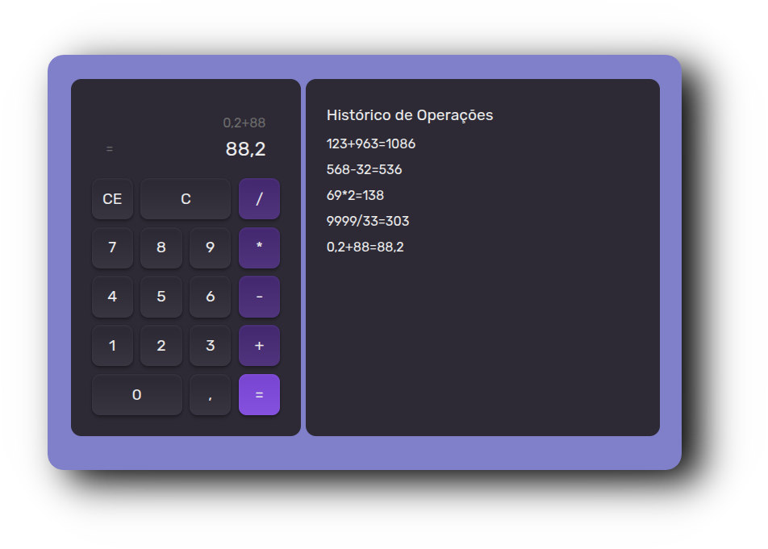

<!--Banner session-->

  
  

   

<!--About session-->
<h1 align="center" style="color:#8257e6"> Project Calculator </h1>

  

<h3> 🚀 Technologies </h3>

This project was developed using the following technologies:

  <code></code>
  <code></code>
  <code></code>
  <code></code>
  <code></code>
  <code></code>
  <code></code>

 
<h3> 👩‍💻 Learnings </h3>

 - React hooks (useState, useEffect)
 - API context (createContext, useContext, provider)
 - Custom hooks
 - LocalStorage
 - Handling Events
 - Variants
 - CSS variables

You can see the project code in this [repository](https://github.com/MichelleCordeiro/rocketseat-react/blob/main/1-fundamentos/4-calc-5-custom-hook.html).

 
<h3> 📝 License </h3>

This project is licensed under the MIT License. See the [LICENSE](LICENSE) file for details.

  

---

Made with 💜 by [Michelle Cordeiro](https://www.linkedin.com/in/michelle-cordeiro/)
